# Vinyl Library - UML Class Diagram

## Overview
本文档包含 Vinyl Library 系统的完整 UML 类图,基于设计文档中的技术规格。

## Package Structure

```
com.vinyllibrary
├── model
│   ├── Vinyl.java
│   ├── VinylState.java
│   ├── AvailableState.java
│   ├── BorrowedState.java
│   ├── ReservedState.java
│   ├── BorrowedAndReservedState.java
│   ├── MarkedForRemovalState.java
│   ├── VinylLibrary.java
│   └── UserSimulator.java
├── viewmodel
│   ├── MainViewModel.java
│   ├── AddVinylViewModel.java
│   └── Session.java
├── view
│   ├── MainViewController.java
│   └── AddVinylController.java
└── util
    └── Observer.java
```

## Complete UML Class Diagram

```mermaid
classDiagram
    %% Model Layer
    class Vinyl {
        -SimpleStringProperty title
        -SimpleStringProperty artist
        -SimpleIntegerProperty releaseYear
        -ObjectProperty~VinylState~ state
        -StringProperty borrowingUserId
        -StringProperty reservingUserId
        -BooleanProperty markedForRemoval
        +Vinyl(String title, String artist, int year)
        +boolean reserve(String userId)
        +boolean borrow(String userId)
        +void returnVinyl()
        +boolean markForRemoval()
        +void remove()
        +String getTitle()
        +String getArtist()
        +int getReleaseYear()
        +VinylState getState()
        +StringProperty titleProperty()
        +StringProperty artistProperty()
        +IntegerProperty releaseYearProperty()
        +StringProperty stateProperty()
        +BooleanProperty markedForRemovalProperty()
        +boolean isAvailable()
        +boolean isBorrowed()
        +boolean isReserved()
        +boolean canBorrow(String userId)
        +boolean canReserve(String userId)
    }

    class VinylState {
        <<interface>>
        +boolean reserve(Vinyl vinyl, String userId)
        +boolean borrow(Vinyl vinyl, String userId)
        +void returnVinyl(Vinyl vinyl)
        +String getStateName()
    }

    class AvailableState {
        +boolean reserve(Vinyl vinyl, String userId)
        +boolean borrow(Vinyl vinyl, String userId)
        +void returnVinyl(Vinyl vinyl)
        +String getStateName()
    }

    class BorrowedState {
        +boolean reserve(Vinyl vinyl, String userId)
        +boolean borrow(Vinyl vinyl, String userId)
        +void returnVinyl(Vinyl vinyl)
        +String getStateName()
    }

    class ReservedState {
        +boolean reserve(Vinyl vinyl, String userId)
        +boolean borrow(Vinyl vinyl, String userId)
        +void returnVinyl(Vinyl vinyl)
        +String getStateName()
    }

    class BorrowedAndReservedState {
        +boolean reserve(Vinyl vinyl, String userId)
        +boolean borrow(Vinyl vinyl, String userId)
        +void returnVinyl(Vinyl vinyl)
        +String getStateName()
    }

    class MarkedForRemovalState {
        -VinylState wrappedState
        -boolean isMarked
        +MarkedForRemovalState(VinylState state)
        +boolean reserve(Vinyl vinyl, String userId)
        +boolean borrow(Vinyl vinyl, String userId)
        +void returnVinyl(Vinyl vinyl)
        +String getStateName()
        +boolean isMarkedForRemoval()
    }

    class VinylLibrary {
        -ObservableList~Vinyl~ vinyls
        -List~Observer~ observers
        +VinylLibrary()
        +void addVinyl(String title, String artist, int year)
        +void removeVinyl(Vinyl vinyl)
        +ObservableList~Vinyl~ getVinyls()
        +boolean reserveVinyl(Vinyl vinyl, String userId)
        +boolean borrowVinyl(Vinyl vinyl, String userId)
        +void returnVinyl(Vinyl vinyl, String userId)
        +boolean markVinylForRemoval(Vinyl vinyl)
        +void addObserver(Observer observer)
        +void removeObserver(Observer observer)
        +void notifyObservers()
        -void notifyVinylChanged(Vinyl vinyl)
    }

    class UserSimulator {
        -VinylLibrary library
        -String userId
        -boolean running
        -Random random
        -Thread simulatorThread
        +UserSimulator(VinylLibrary library, String userId)
        +void run()
        +void start()
        +void stop()
        -void performRandomAction()
        -Vinyl selectRandomVinyl()
        -int getRandomInterval()
    }

    %% ViewModel Layer
    class MainViewModel {
        -VinylLibrary library
        -Session session
        -ObjectProperty~Vinyl~ selectedVinyl
        -StringProperty currentUserId
        -ObservableList~Vinyl~ vinylList
        -BooleanProperty canReserve
        -BooleanProperty canBorrow
        -BooleanProperty canReturn
        -BooleanProperty canRemove
        -List~Observer~ observers
        +MainViewModel(VinylLibrary library, Session session)
        +void bindToModel(VinylLibrary library)
        +void onVinylSelected(Vinyl vinyl)
        +void updateActionStates()
        +void reserve()
        +void borrow()
        +void return_()
        +void remove()
        +void onVinylStateChanged(Vinyl vinyl)
        +ObservableList~Vinyl~ getVinylList()
        +ObjectProperty~Vinyl~ selectedVinylProperty()
        +BooleanProperty canReserveProperty()
        +BooleanProperty canBorrowProperty()
        +BooleanProperty canReturnProperty()
        +BooleanProperty canRemoveProperty()
    }

    class AddVinylViewModel {
        -VinylLibrary library
        -StringProperty title
        -StringProperty artist
        -IntegerProperty releaseYear
        -BooleanProperty isValid
        +AddVinylViewModel(VinylLibrary library)
        +void addVinyl()
        +void validateForm()
        +void clearForm()
        +StringProperty titleProperty()
        +StringProperty artistProperty()
        +IntegerProperty releaseYearProperty()
        +BooleanProperty isValidProperty()
    }

    class Session {
        -static Session instance
        -StringProperty currentUserId
        -ObjectProperty~Vinyl~ selectedVinyl
        -Session()
        +static Session getInstance()
        +String getCurrentUserId()
        +void setCurrentUserId(String userId)
        +Vinyl getSelectedVinyl()
        +void setSelectedVinyl(Vinyl vinyl)
        +StringProperty currentUserIdProperty()
        +ObjectProperty~Vinyl~ selectedVinylProperty()
    }

    %% View Layer
    class MainViewController {
        -MainViewModel viewModel
        -UserSimulator simulator
        @FXML private TableView~Vinyl~ vinylTable
        @FXML private TableColumn~Vinyl, String~ titleColumn
        @FXML private TableColumn~Vinyl, String~ artistColumn
        @FXML private TableColumn~Vinyl, Integer~ yearColumn
        @FXML private TableColumn~Vinyl, String~ stateColumn
        @FXML private Button reserveButton
        @FXML private Button borrowButton
        @FXML private Button returnButton
        @FXML private Button removeButton
        @FXML private Button addVinylButton
        @FXML private Button startSimulationButton
        @FXML private Button stopSimulationButton
        +void initialize()
        +void onReserveClicked()
        +void onBorrowClicked()
        +void onReturnClicked()
        +void onRemoveClicked()
        +void onAddVinylClicked()
        +void onStartSimulationClicked()
        +void onStopSimulationClicked()
    }

    class AddVinylController {
        -AddVinylViewModel viewModel
        -Stage stage
        @FXML private TextField titleField
        @FXML private TextField artistField
        @FXML private TextField yearField
        @FXML private Button saveButton
        @FXML private Button cancelButton
        +void initialize()
        +void onSaveClicked()
        +void onCancelClicked()
        +void setStage(Stage stage)
    }

    %% Utility
    class Observer {
        <<interface>>
        +void update(Vinyl vinyl)
    }

    %% Main Application
    class Main {
        -VinylLibrary library
        -Session session
        +static void main(String[] args)
        +void start(Stage primaryStage)
    }

    %% Relationships
    Vinyl --> VinylState : uses
    VinylState <|.. AvailableState
    VinylState <|.. BorrowedState
    VinylState <|.. ReservedState
    VinylState <|.. BorrowedAndReservedState
    MarkedForRemovalState o-- VinylState : wraps
    VinylLibrary --> Vinyl : contains
    VinylLibrary --> Observer : notifies
    UserSimulator --> VinylLibrary : uses
    MainViewModel --> VinylLibrary : uses
    MainViewModel --> Session : uses
    MainViewModel --> Observer : implements
    AddVinylViewModel --> VinylLibrary : uses
    MainViewController --> MainViewModel : uses
    MainViewController --> UserSimulator : uses
    AddVinylController --> AddVinylViewModel : uses
    Main --> VinylLibrary : creates
    Main --> Session : uses
```



## Detailed Class Descriptions

### Model Layer Classes

#### Vinyl
核心实体类,使用 JavaFX 属性支持数据绑定。包含所有状态管理逻辑和业务规则。

#### VinylState Interface
状态模式接口,定义了所有状态必须实现的方法。

#### Concrete State Classes
- **AvailableState**: Vinyl 可借阅和预约
- **BorrowedState**: Vinyl 已被借出,可被预约
- **ReservedState**: Vinyl 已被预约,只有预约者可借阅
- **BorrowedAndReservedState**: Vinyl 既被借出又被预约
- **MarkedForRemovalState**: 装饰器模式,标记 Vinyl 为待移除状态

#### VinylLibrary
管理 Vinyl 集合的单例或集中管理类,实现观察者模式通知状态变化。

#### UserSimulator
实现 Runnable 接口,在后台线程模拟多用户随机操作。

### ViewModel Layer Classes

#### MainViewModel
主视图模型,连接 Model 和 View,提供数据绑定和命令处理。

#### AddVinylViewModel
添加 Vinyl 表单的视图模型,处理表单验证和数据提交。

#### Session
单例类,存储跨视图的共享状态(当前用户 ID、选中的 Vinyl)。

### View Layer Classes

#### MainViewController
主界面控制器,处理 UI 事件和用户交互。

#### AddVinylController
添加 Vinyl 对话框控制器,管理表单输入和窗口生命周期。

### Utility Classes

#### Observer Interface
观察者模式接口,定义通知机制。

#### Main
应用程序入口,初始化 Model、ViewModel 和 View 层。

## Key Design Patterns

1. **MVVM Pattern**: 分离 Model、View 和 ViewModel
2. **State Pattern**: Vinyl 使用状态对象管理不同状态
3. **Observer Pattern**: 状态变化通知所有观察者
4. **Singleton Pattern**: Session 确保全局唯一实例
5. **Decorator Pattern**: MarkedForRemovalState 包装现有状态

## Data Binding Flow

```
Vinyl (Model)
    ↓ (ObservableList<Vinyl>)
MainViewModel
    ↓ (Data Binding)
TableView (View)
    ↓ (User Selection)
MainViewModel
    ↓ (Command)
VinylLibrary (Model)
    ↓ (State Change)
Vinyl
    ↓ (Observer Notification)
MainViewModel
    ↓ (Property Change)
TableView (View)
```

## Thread Safety Considerations

1. **VinylLibrary** 的方法使用 `synchronized` 关键字确保线程安全
2. **ObservableList** 使用 `FXCollections.synchronizedObservableList()` 包装
3. **UserSimulator** 在独立线程运行,通过 `Platform.runLater()` 更新 UI
4. 所有状态转换操作都是原子的
