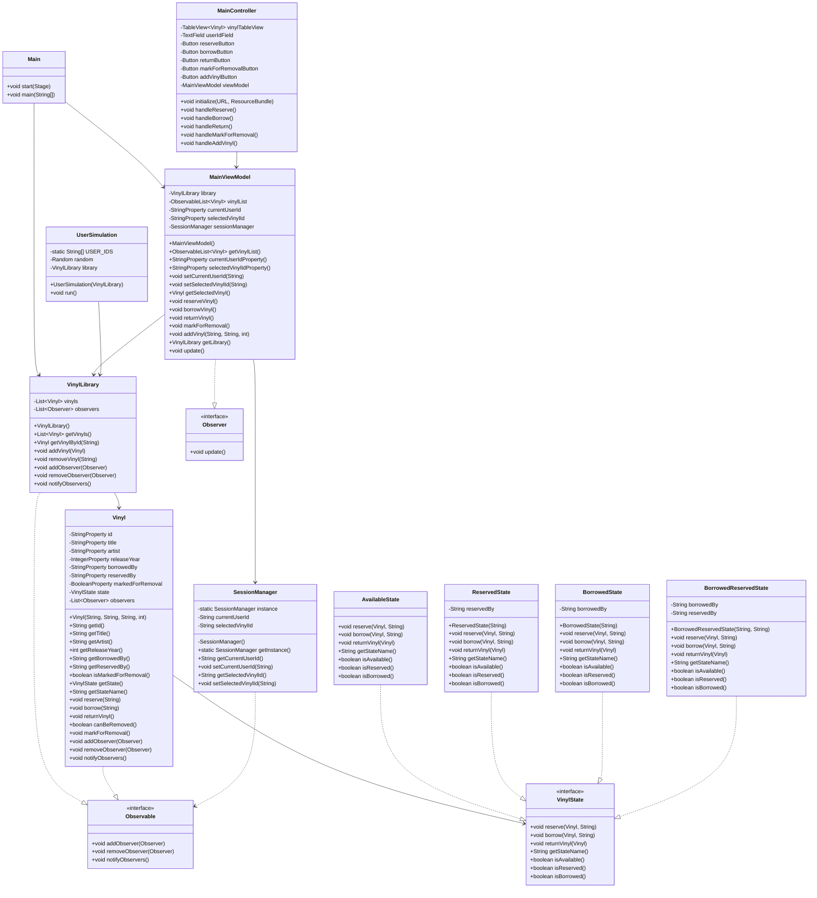

# Vinyl Library - Class Diagram

## UML Class Diagram

## Pattern Implementations

### MVVM Pattern
- **Model**: Vinyl, VinylLibrary
- **ViewModel**: MainViewModel
- **View**: MainController + main-view.fxml

### Observer Pattern
- **Observable Interface**: Vinyl, VinylLibrary implement this
- **Observer Interface**: MainViewModel implements this
- VinylLibrary observes changes in Vinyl objects
- MainViewModel observes changes in VinylLibrary

### State Pattern
- **State Interface**: VinylState
- **Concrete States**: AvailableState, ReservedState, BorrowedState, BorrowedReservedState
- **Context**: Vinyl class
- State transitions are handled by the state objects themselves

### Session Management
- **Singleton**: SessionManager
- Holds current user ID and selected vinyl ID
- Shared between ViewModel and other components
