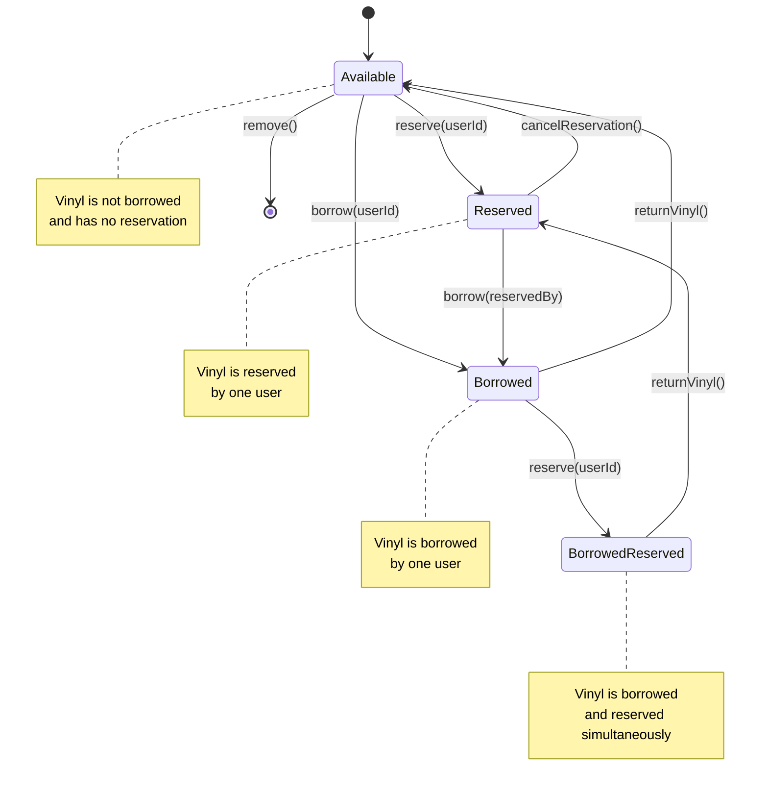

# Vinyl Library - State Machine Diagram

## Vinyl State Machine

The following diagram shows the state transitions for a Vinyl object:

## State Descriptions

### Available
- The vinyl is not borrowed
- The vinyl has no reservation
- Can be reserved by any user
- Can be borrowed by any user
- Can be removed from the library

### Reserved
- The vinyl is reserved by one user
- Only the user who reserved it can borrow it
- Cannot be reserved again
- Can be returned to Available state if reservation is cancelled

### Borrowed
- The vinyl is currently borrowed by one user
- Can be reserved by another user (transitions to BorrowedReserved)
- When returned, transitions to Available state

### BorrowedReserved
- The vinyl is both borrowed and reserved
- The borrowing user has the vinyl
- Another user has a reservation for when it's returned
- When returned, transitions to Reserved state

## Marked for Removal Flag

When a vinyl is marked for removal:
- If in Available state: Cannot be reserved again
- If in Borrowed or Reserved state: Will be removed when it becomes Available
- The user who reserved it can still borrow it before removal
